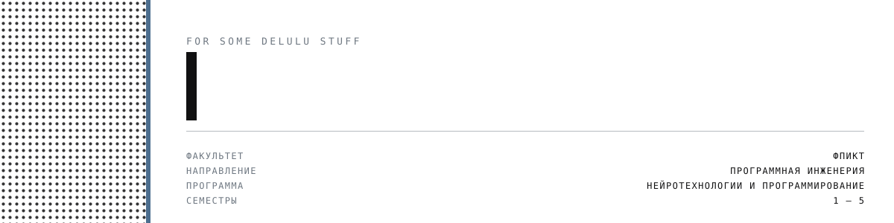

<picture>
  <source media="(prefers-color-scheme: dark)" srcset="assets/hero-dark.svg">
  
</picture>

Лабораторные и учебные материалы по профильным дисциплинам направления
**Программная инженерия**, программа «Нейротехнологии и программирование», ФПИКТ ИТМО.

## ПРЕДМЕТЫ

| дисциплина | семестр | содержание |
|---|---|---|
| [Программирование](./prog) | 1 · 2 | лабораторные на Java и теория к ним |
| [Основы профессиональной деятельности](./OPD) | 1 · 2 | 2-я лабораторная — БЭВМ; во втором семестре командный проект |
| [Базы данных](./DataBases) | 2 | PostgreSQL, проектирование и запросы |
| [Основы программной инженерии](./OPI) | 4 | SRS, Git, Gradle, Docker, тестирование, профилирование |
| [Архитектура компьютера](./CSA) | 4 | четыре asm-программы под разные архитектуры, схема ACC32, билеты |
| [Операционные системы](./OSI) | 5 | soon |
| [Полигональное моделирование](./polymod) | 5 | soon |
| [Нейрофизиология](./neurophysiology) | 5 | soon |
| [Основы анализа данных](./data-analys) | 5 | soon |
| [Системы искусственного интеллекта](./artificial-intelligence-systems) | 5 | soon |
| [Разработка мобильных приложений](./mobile-dev) | 5 | soon |

